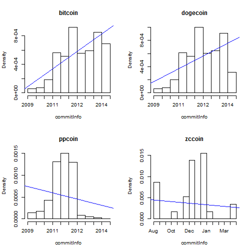

AltcoinAnalysis Feasibility Study
========================================================
author: ZhangShiwei
date: 2014.9.4

What I Did
========================================================

- Collecting informations from http://coinmarketcap.com/
- Getting informations from <a href="https://github.com/settings/applications/127800">Github API</a>
- Getting informations from git repositories of Altcoins
- Using R, ggplot2 and Knit to visualize these data

Downloading Repos
========================================================

this script is avaliable in /Rcode/downloadSourceFromGithub.R


```r
coinInfo <- read.table("./Data/coinInfo.txt")
setwd("./Data/sourceCode")
for(i in 1:nrow(coinInfo)){
  system(paste("git clone",coinInfo[i,"githubAddress"]))
}
setwd("../../")
```

Getting Informations From Github API
========================================================


```r
source("./Rcode/makeTableOfGithubInfo.R")
makeTableOfGithubInfo()
```


```
         coin   size star network subscriber
1     bitcoin 102159 5789    4170        763
2    litecoin 113884  955    4170        240
3    dogecoin 109714  991     433        172
4   bitshares  50198   82    4170         62
5      ppcoin  26870  215    4170         58
6      zccoin   2020    3       7          4
7 icebergcoin   2195    1       3          1
```

Getting Informations From Git Repos
========================================================


```r
source("./Rcode/makeTableOfSourceInfo.R")
makeTableOfSourceInfo()
```


```
         coin counts intercept         k
1     bitcoin   6654  -7715.93  0.544242
2   bitshares   4100    688.13 -0.018061
3    dogecoin   6107  -5491.90  0.396273
4 icebergcoin      4      4.00        NA
5    litecoin   4250    284.07  0.009152
6      ppcoin   2873   2429.77 -0.139121
7      zccoin     29     56.78 -0.003407
```

Findings
========================================================

 

***

<small>*As the rank has a big scale, I use log(rank) to generize plot</small>

It can be seem from the plot that the size of the repo is relevent to the rank of Altcoins

Findings
========================================================

 

***

There might be some connection between the commits density of date, so I include the slope of the regression line in the final data.

Findings
========================================================

 

***

It seems like subscriber and star are the same accroding to the heatmap, so we can delete one of them in our final data. And this plot is also a proof that there be connection between develop activity and coin rank, as the order of coin is generally the same as their rank

Conclusion
========================================================

There be some connection between develop activity and coin rank, we can do further study like following:

- finding more indicators that can indicate developing activity
- trainning a 


